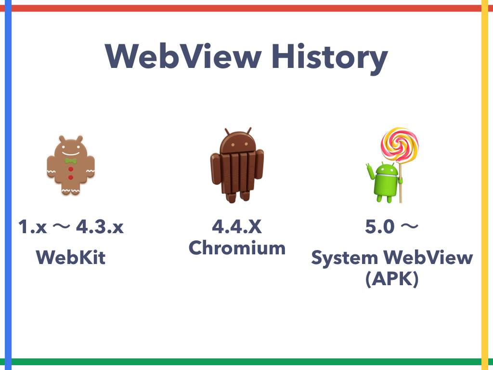
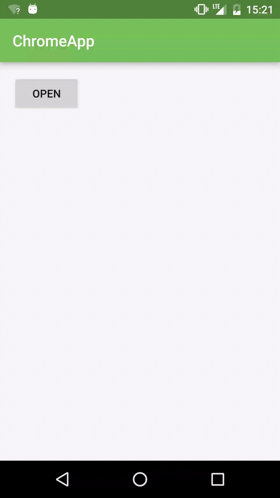
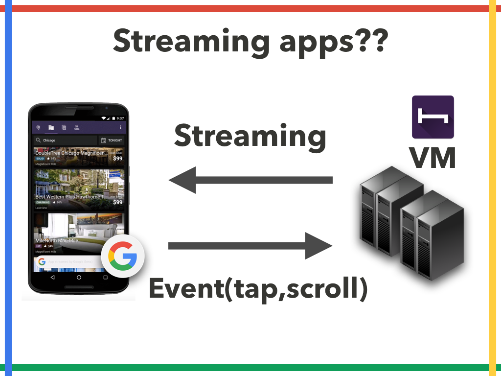

#  ChromeとAndroidの 過去・現在・未来 Droidkaigi 2016

# 資料

* [SlideShare](http://www.slideshare.net/shinobuokano7/chromeandroid-58461091)

#  This is the last session of DroidKaigi

# Thank you for coming to my session.

# 最後まで楽しんでください！

# shinobu.apk

* shinobu.apk #1 のパネルディスカッション 録音データとShow Notesを公開しました！
* http://hack-it-iron.hatenablog.com/entry/2016/02/08/142322

# まったりAndroid Framework Code Reading

* まったりAndroid Framework Code Reading #2 を開催しました
* * http://hack-it-iron.hatenablog.com/entry/2015/11/28/185529

## WebView

* つ ら い

## WebView History

## Google I/O 2012 Android WebView

https://www.youtube.com/watch?v=HbOtn5VhGZU

## Migrating to WebView in Android 4.4

http://developer.android.com/guide/webapps/migrating.html

## Android System WebView

https://play.google.com/store/apps/details?id=com.google.android.webview

## Android WebView の進化と実装

http://outcesticide.hatenablog.com/entry/android_webview

# Chrome Custom Tabs

*  Show the Chrome Tab like a my app browser

## Intent

* Intentで任意のURLを開く

## Chrome Custom Tabs

* Chrome Custom Tabsで開く

## Chrome Custom Tabs

## Intent App Process Chrome Process Chrome Custom Tabs

## Setup Chrome Custom Tabs

## Custom Tabs Support Library Setup Chrome Custom Tabs https://developer.android.com/tools/support- library/features.html#custom-tabs

## Setup Chrome Custom Tabs https://github.com/GoogleChrome/custom-tabs- client/tree/master/shared Shared util module (Optional)

## Chrome Custom Tabs Starter Kit Setup Chrome Custom Tabs https://github.com/operando/chrome-custom-tabs-starterkit

## dependencies { compile 'com.android.support:customtabs:23.1.1' compile project(':shared') } Setup Chrome Custom Tabs

## Uri URI = Uri.parse("https://android.com/"); CustomTabsIntent tabsIntent = new CustomTabsIntent.Builder().build(); String package = CustomTabsHelper.getPackageNameToUse(this); tabsIntent.intent.setPackage(package); tabsIntent.launchUrl(this, URI); Setup Chrome Custom Tabs

## app to customize how Chrome looks and feels

## Toolbar color Toolbar close button Enter and exit animations Add actions to the toolbar Add overflow menu UI customization

## CustomTabsIntent tabsIntent = new CustomTabsIntent.Builder() .setShowTitle(true) .setToolbarColor(0x77C159) .setStartAnimations(this, R.anim.slide_in_right, R.anim.slide_out_left) .setExitAnimations(this, R.anim.slide_in_left, R.anim.slide_out_right) .setCloseButtonIcon(back) .setActionButton(droid, "android", getActionButtonIntent()) .addMenuItem("android menu", getActionButtonIntent()) .build(); String package = CustomTabsHelper.getPackageNameToUse(this); tabsIntent.intent.setPackage(package); tabsIntent.launchUrl(this, Uri.parse("https://android.com/")); UI customization

## UI Customize

## No Customize UI Customize

## making the transition from app to web content fast and seamless

## optimized to load faster than WebViews and traditional methods of launching Chrome

## http://3.bp.blogspot.com/-bsqTJQg_KG8/VecqcRS1SnI/ AAAAAAAACAM/nclxZZ1bOxA/s1600/CCT_Large%2B2.gif

## Warm up / Pre-fetch

## Use Chrome features Ssecurity Saved passwords Data Saver Shared cookie more features…

## Chrome Custom Tabs can replace the WebView?

## NO!!!!!!!!!!

## Why?

## Why? 細かいHandlingができない + 秘伝のWebChromeClient + 秘伝のWebViewClient + JavaScriptInterface

## Why? 細かいHandlingができない + 秘伝のWebChromeClient + 秘伝のWebViewClient + JavaScriptInterface

## Why? CustomTabsCallback#onNavigatio nEventメソッドでページ(Tab)を 読み込み開始・終了、閉じた・開いた くらいのことなら通知してくれる

## Best Practices for Custom Tabs https://medium.com/google-developers/best-practices-for- custom-tabs-5700e55143ee

## Android Intents with Chrome

## Android Intents with Chrome ChromeがIntent SyntacなURLを 解釈してIntentを実行する

## Android Intents with Chrome <intent-filter> <action android:name="android.intent.action.VIEW" /> <category android:name="android.intent.category.DEFAULT" /> <category android:name="android.intent.category.BROWSABLE" /> <data android:scheme="mercariapp" android:host="run:" /> </intent-filter>

## Android Intents with Chrome <a href= “intent://run/#Intent; scheme=mercariapp;package=com.mercariapp.mercari; end”> Run Mercari </a>

## Android Intents with Chrome https://developer.chrome.com/ multidevice/android/intents

## Debugging WebViews

## Debugging WebViews webView.setWebContentsDebuggingEnabled(true); Android 4.4 以上

## Debugging WebViews

## Debugging WebViews

## Web App Manifest

## Define the metadata associated with your web application in a JSON-based manifest.

## name icons display theme_color background_color etc. Manifest and its members

##

{ "name": "Google I/O 2015", "short_name": "I/O 2015", "display": "standalone", "icons": [{ "src": "images/touch/homescreen144.png", "sizes": "144x144", "type": "image/png" },…..], "gcm_sender_id": "608394197750", "gcm_user_visible_only": true } Manifest by Google IO 2015 https://events.google.com/io2015/manifest.json
##

<link rel="manifest" href="manifest.json"> Manifest by Google IO 2015 view-source:https://events.google.com/io2015/

## manifest HTTPS Service Worker visited your site twice over two separate days during the course of two weeks App Install Banner

## App Install Banner

## Web Push Notification(GCM) Cache API Background Sync API etc. Service Worker

##  スマートフォン体験を一歩先へ プログレッシブウェブアプリの作り方 https://docs.google.com/presentation/d/ 1VcXsKDaCUpf2SS35WNcrKslkK6PcXxWsnhcKiLfWCXs/ edit#slide=id.gf39949af9_0_0 by Google Eiji Kitamura

##  ??

##  Web App Manifest Ⅱ Web Technology

##  but

##  Native app install banner

##  similar to Web app install banners, but instead of adding to the home screen will let the user install your native app without leaving your site Native app install banner

##  You have a web app manifest file Site is served over HTTPS The user has visited your site twice over two separate days during the course of two weeks Criteria to Show the Banner

##  chrome://flags/#bypass-app-banner- engagement-checks Testing flag

##  { "name": "Native app install banner Sample", "short_name": "Native app install banner Sample", "icons": [{ "src": "image/ic_android_black_48dp.png", "sizes": "144x144", "type": "image/png" }], "prefer_related_applications": true, "related_applications": [{ "platform": "play", "id": "com.kouzoh.mercari" }] } Native app install banner manifest.json

##  Web App Manifest https://www.w3.org/TR/appmanifest/ 草案（Working Draft）

##  Native app Install Banners https://developers.google.com/web/fundamentals/engage- and-retain/app-install-banners/native-app-install

##  App Stream

* when Google finds in-app content that points to a mobile app you don’t already have installed, it will offer you the option to “stream” the app instead.
*  To run the application in the streaming when application don’t have installed.
* “This uses a new cloud-based technology that we’re currently experimenting with”
* http://insidesearch.blogspot.jp/2015/11/new-ways-to-find-and-stream-app-content.html
*  http://3.bp.blogspot.com/-2Ats2zhc0HQ/Vkyq3JlcEiI/AAAAAAABBrA/hcfu4p02Fn4/s1600/app-stream-w-dots.gif

##  Streaming apps??

##  New ways to find (and stream) app content in Google Search

http://insidesearch.blogspot.jp/2015/11/new-ways-to-find-and-stream-app-content.html

##  Trial Run Ads

* App ad format that lets a user play a game for up to 60 seconds by streaming content from the app before downloading
* http://2.bp.blogspot.com/-9v_0t2rKlzM/Vl-wzBxLs8I/AAAAAAAACGo/hU-Nndu-AIg/s1600/Trial%2BRun%2BAd%2Bgif%2Bfor%2BSGN.gif

##  Introducing new interactive ads to drive app installs

http://adwords.blogspot.jp/2015/12/trial-run-ads-interactive-interstitials-beta.html

##  Chrome Platform Status

https://www.chromestatus.com/features

##  ChromeとAndroidの 今後について

##  Thanks!!

Enjoy After Party!!
