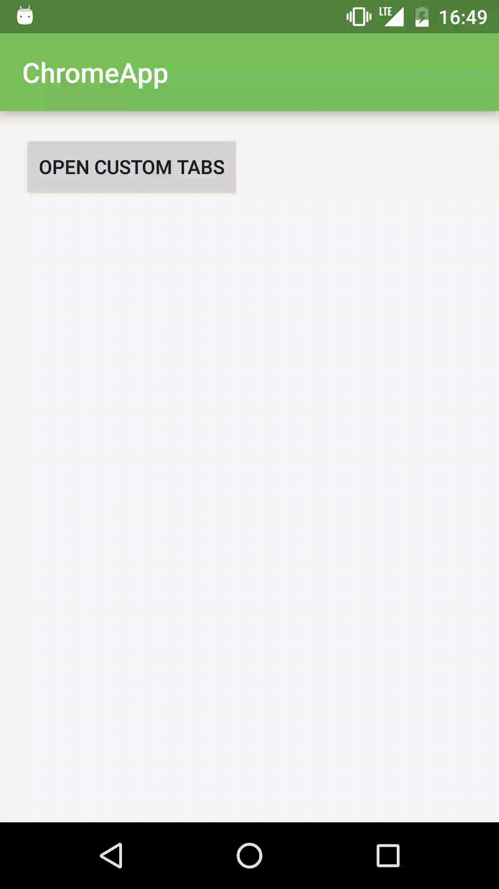
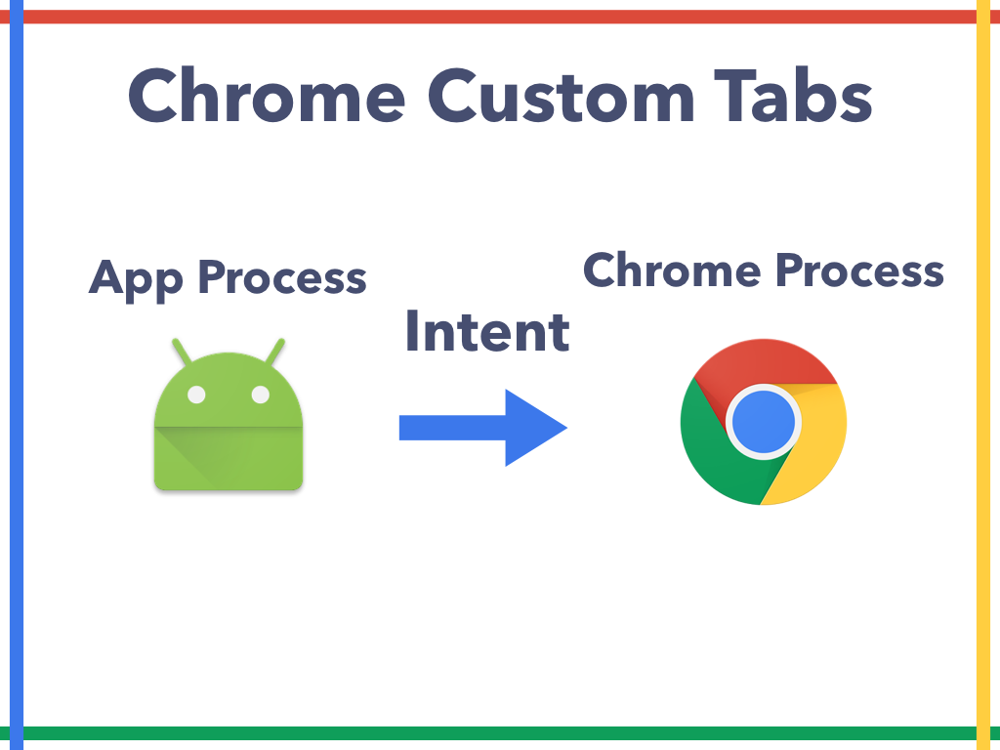
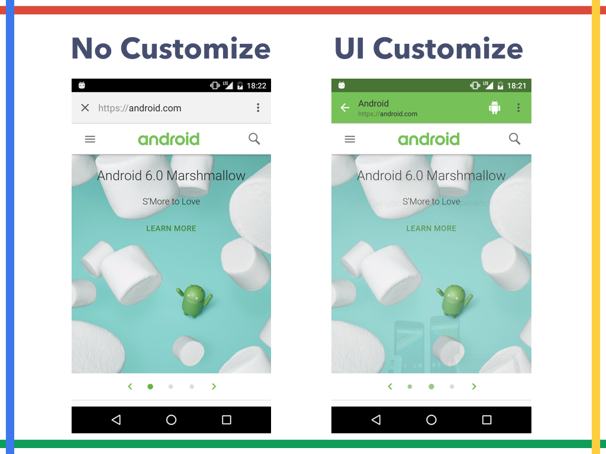
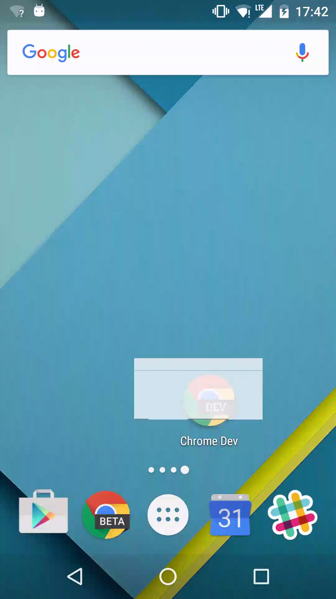

#  ChromeとAndroidの 過去・現在・未来

# 資料

* [SlideShare](http://www.slideshare.net/shinobuokano7/chromeandroid-58461091)
* [Native app install banner sample page](https://github.com/operando/NativeAppInstallBannerSample)
* [Chrome custom tabs starterkit ](https://github.com/operando/chrome-custom-tabs-starterkit)


#  This is the last session of DroidKaigi


# Thank you for coming to my session.


# 最後まで楽しんでください！


# shinobu.apk

* shinobu.apk #1 のパネルディスカッション 録音データとShow Notesを公開しました！
* http://hack-it-iron.hatenablog.com/entry/2016/02/08/142322


# まったりAndroid Framework Code Reading

* まったりAndroid Framework Code Reading #2 を開催しました
* * http://hack-it-iron.hatenablog.com/entry/2015/11/28/185529


## WebView

* つ ら い


## WebView History


## Google I/O 2012 Android WebView

https://www.youtube.com/watch?v=HbOtn5VhGZU


## Migrating to WebView in Android 4.4

http://developer.android.com/guide/webapps/migrating.html


## Android System WebView

https://play.google.com/store/apps/details?id=com.google.android.webview


## Android WebView の進化と実装

http://outcesticide.hatenablog.com/entry/android_webview


# Chrome Custom Tabs

*  Show the Chrome Tab like a my app browser


## Intent

* Intentで任意のURLを開く


## Chrome Custom Tabs

* Chrome Custom Tabsで開く





## Chrome Custom Tabs





# Setup Chrome Custom Tabs

* Custom Tabs Support Library
 * https://developer.android.com/tools/support-library/features.html#custom-tabs
* Shared util module (Optional)
 * https://github.com/GoogleChrome/custom-tabs-client/tree/master/shared


```gradle
dependencies {
     compile 'com.android.support:customtabs:23.1.1'
     compile project(':shared')
}
```

* Chrome Custom Tabsで任意のURLを開く実装

```java
Uri URI = Uri.parse("https://android.com/");
CustomTabsIntent tabsIntent = new CustomTabsIntent.Builder().build();
String package = CustomTabsHelper.getPackageNameToUse(this);
tabsIntent.intent.setPackage(package);
tabsIntent.launchUrl(this, URI);
```

## Chrome Custom Tabs Starter Kit

* Chrome Custom Tabs Starter Kitというgit cloneして実行するだけでとりあえず始められるProject作った
* https://github.com/operando/chrome-custom-tabs-starterkit


## UI customization

app to customize how Chrome looks and feels

## UI customization
* Toolbar color
* Toolbar close button
* Enter and exit animations
* Add actions to the toolbar
* Add overflow menu


## UI customization

```java
CustomTabsIntent tabsIntent = new CustomTabsIntent.Builder()
    .setShowTitle(true)
    .setToolbarColor(0x77C159)
    .setStartAnimations(this, R.anim.slide_in_right, R.anim.slide_out_left)
    .setExitAnimations(this, R.anim.slide_in_left, R.anim.slide_out_right)
    .setCloseButtonIcon(back)
    .setActionButton(droid, "android", getActionButtonIntent())
    .addMenuItem("android menu", getActionButtonIntent()) .build();
String package = CustomTabsHelper.getPackageNameToUse(this);
tabsIntent.intent.setPackage(package);
tabsIntent.launchUrl(this, Uri.parse("https://android.com/"));
```


## UI Customize


## No Customize vs UI Customize




##  making the transition from app to web content fast and seamless

* optimized to load faster than WebViews and traditional methods of launching Chrome
* http://3.bp.blogspot.com/-bsqTJQg_KG8/VecqcRS1SnI/AAAAAAAACAM/nclxZZ1bOxA/s1600/CCT_Large%2B2.gif


## Use Chrome features

* Ssecurity
* Saved passwords
* Data Saver
* Shared cookie
* more features…


## Chrome Custom Tabs can replace the WebView?

*  NO!!!!!!!!!!

## Why?

* 細かいHandlingができない
 * 秘伝のWebChromeClient
 * 秘伝のWebViewClient
 * JavaScriptInterface
 * これらは使えない
* CustomTabsCallback#onNavigationEventメソッドでページ(Tab)を読み込み開始・終了、閉じた・開いたくらいのことなら通知してくれる


## Best Practices for Custom Tabs

https://medium.com/google-developers/best-practices-for-custom-tabs-5700e55143ee


# Android Intents with Chrome

* ChromeがIntent SyntacなURLを 解釈してIntentを実行する
* https://developer.chrome.com/multidevice/android/intents


```xml
<intent-filter>
    <action android:name="android.intent.action.VIEW" />
    <category android:name="android.intent.category.DEFAULT" />
    <category android:name="android.intent.category.BROWSABLE" />
    <data android:scheme="mercariapp" android:host="run:" />
</intent-filter>
```

```html
<a href= “intent://run/#Intent; scheme=mercariapp;package=com.mercariapp.mercari; end”>Run Mercari</a>
```


# Debugging WebViews

* Android 4.4 以上
* [Remote Debugging WebViews](https://developers.google.com/web/tools/chrome-devtools/debug/remote-debugging/webviews)
 * https://developers.google.com/web/tools/chrome-devtools/debug/remote-debugging/webviews

```java
webView.setWebContentsDebuggingEnabled(true);
```

## Web App Manifest

* Define the metadata associated with your web application in a JSON-based manifest.

* name
* icons
* display
* background_color
* etc.


## Manifest by Google IO 2015

* https://events.google.com/io2015/manifest.json

```json
{
    "name": "Google I/O 2015",
    "short_name": "I/O 2015",
    "display": "standalone",
    "icons": [{
        "src": "images/touch/homescreen144.png",
        "sizes": "144x144",
        "type": "image/png"
        },…..],
    "gcm_sender_id": "608394197750",
    "gcm_user_visible_only": true
 }
```

* Manifest by Google IO 2015
 * view-source:https://events.google.com/io2015/

```html
<link rel="manifest" href="manifest.json">
```

# [Native app install banner](https://developers.google.com/web/fundamentals/engage-and-retain/app-install-banners/native-app-install)

* similar to Web app install banners, but instead of adding to the home screen will let the user install your native app without leaving your site
* https://developers.google.com/web/fundamentals/engage-and-retain/app-install-banners/native-app-install




## Criteria to Show the Banner

* You have a web app manifest file Site
* is served over HTTPS
* The user has visited your site twice over two separate days during the course of two weeks

## Testingflag

* chrome://flags/#bypass-app-banner-engagement-checks
 * この条件を省略できる → 「The user has visited your site twice over two separate days during the course of two weeks」


##  Native app install banner - manifest.json

```json
{
    "name": "Native app install banner Sample",
    "short_name": "Native app install banner Sample",
    "icons": [{
        "src": "image/ic_android_black_48dp.png",
        "sizes": "144x144",
        "type": "image/png"
    }],
    "prefer_related_applications": true,
    "related_applications": [{
        "platform": "play",
        "id": "com.kouzoh.mercari"
    }]
}
```


## Progressive Web Apps

* Web Push Notification(GCM)
* Cache API
* Background Sync API
* Service Worker
* etc.

## スマートフォン体験を一歩先へ プログレッシブウェブアプリの作り方 by Google Eiji Kitamura

* [スマートフォン体験を一歩先へ プログレッシブウェブアプリの作り方](https://docs.google.com/presentation/d/ 1VcXsKDaCUpf2SS35WNcrKslkK6PcXxWsnhcKiLfWCXs/ edit#slide=id.gf39949af9_0_0)
 * https://docs.google.com/presentation/d/1VcXsKDaCUpf2SS35WNcrKslkK6PcXxWsnhcKiLfWCXs/edit#slide=id.gf39949af9_0_0


##  Web App Manifest

* https://www.w3.org/TR/appmanifest/
 * 草案（Working Draft）


#  App Stream

* when Google finds in-app content that points to a mobile app you don’t already have installed, it will offer you the option to “stream” the app instead.
*  To run the application in the streaming when application don’t have installed.
* “This uses a new cloud-based technology that we’re currently experimenting with”
* http://insidesearch.blogspot.jp/2015/11/new-ways-to-find-and-stream-app-content.html
* http://3.bp.blogspot.com/-2Ats2zhc0HQ/Vkyq3JlcEiI/AAAAAAABBrA/hcfu4p02Fn4/s1600/app-stream-w-dots.gif


##  Streaming apps??


##  New ways to find (and stream) app content in Google Search

http://insidesearch.blogspot.jp/2015/11/new-ways-to-find-and-stream-app-content.html


##  Trial Run Ads

* App ad format that lets a user play a game for up to 60 seconds by streaming content from the app before downloading
* http://2.bp.blogspot.com/-9v_0t2rKlzM/Vl-wzBxLs8I/AAAAAAAACGo/hU-Nndu-AIg/s1600/Trial%2BRun%2BAd%2Bgif%2Bfor%2BSGN.gif


##  Introducing new interactive ads to drive app installs

http://adwords.blogspot.jp/2015/12/trial-run-ads-interactive-interstitials-beta.html


##  Chrome Platform Status

https://www.chromestatus.com/features


##  ChromeとAndroidの 今後について


##  Thanks!!

Enjoy After Party!!
