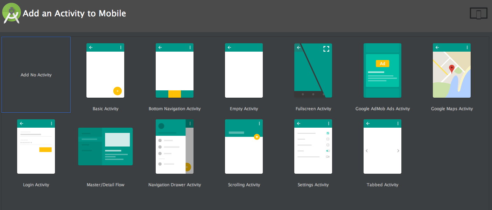
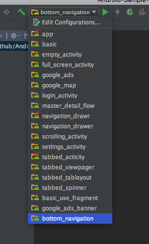
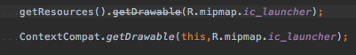
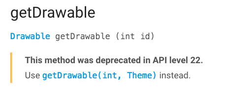
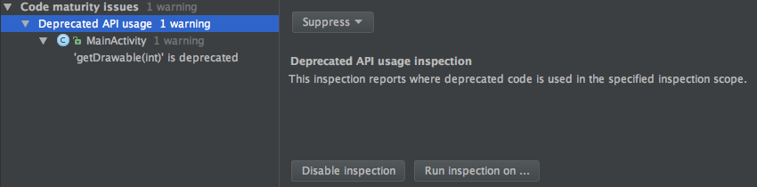

# Androidアプリ開発の体力づくり💪

## 資料

* [speakerdeck](https://speakerdeck.com/operando/androidapurikai-fa-falseti-li-dukuri)

## Android楽しいですかー？😊

## Android開発難しそう

## そんなことないよ

## Android開発楽しいぞ😊

## やってみたけど
何から始めたらいいのかわからない

## わかる

## アプリを作る過程

* 作りたいアプリを考えるぞ！💪
* 環境構築するぞ！💪
* 実装するぞ！💪
* 公開するぞ！💪

## 作りたいアプリを考えるぞ！💪

## どんなもの作ったらいいんだろ🤔

## んー...🤔

## ん、んんー...🤔🤔

## んんん、んんー...🤔🤔🤔

## 僕はいまいち思い浮かばなかった😐

## とある金髪曰く...

* 作りたいアプリがなかった
* アプリのデザインに悩んで実装が進まない

## 個人でアプリを公開するのに何年かかったか

## 4

## 日？ヶ月？

## 4年です…🙈

## ジレンマ

* ある程度できるようになると実装よりもその
前段階が大変
　* 幸せな悩みだなーと実感する
(技術力を持て余してる)
* 実装はできるんだけどねーみたいな何もできない人化する😨

## ジレンマ解消するぞ！💪

* 雑なアプリでいい！

## ジレンマ解消するぞ！💪

* 小さく始める

## ジレンマ解消するぞ！💪

* 面白いそうなものを作る

## ジレンマ解消するぞ！💪

* 雑なものでも公開まですれば学びがある

## 4年かけて公開した自慢のアプリ💪

* Neko Atsume Launcher
* https://github.com/operando/Neko-Atsume-Launcher

## Developer登録しておこう！

* https://support.google.com/googleplay/android-developer/answer/6112435?hl=ja

## 環境構築やってくぞ！💪

## Android Studio

## Android Studioのハマりどころ🕳

* 俺が教える最強のKeyboard Shortcuts✨
* 俺がおすすめする最強のPlugin✨

## いやまじごめん

## どうでもいいわー😫 ※ はじめはね！

## Android Studio

* はじめは基本操作だけ覚えることに専念した方がいい
* 日頃IntelliJで使ってる人は設定をimportすると楽
* shortcutとかの紹介あって「覚えられないよー」となる
 * 覚えなくてもある程度書ける
 * ショートカット疲弊しないように気をつける

## ただ

* ただ継続的に使うものなので、どこかで色々やってみることは必要
* 不便だなー、もっと他にいい方法ありそうだけどなーとか思ったら調べてみる
* あと色んな機能が入ってるのでそれは慣れてきた時に触ってみるといい

## Android Studio User Guide

* https://developer.android.com/studio/intro/index.html

## Android Studio最速入門～効率的にコーディングするための使い方

* http://gihyo.jp/dev/serial/01/android_studio

## Android Studio Plugin周り

* 去年のDroidKaigiでいくつか紹介しました
* https://www.slideshare.net/shinobuokano7/android-dev-tools-knowledge#40

## 実装・アプリを作るぞ！💪

## 実装・アプリを作るぞ！💪

* コードを書く
* デザイン

## Androidの開発言語はなんですか？🙂

## Javaです💪

## どうやって実装したらいんだろ🤔

## サンプルで学んでいこう💪

## Android Studio New Project Wizard

## １つ１つ作って動かすのめんどい😩

## Android Studio Sample Projects

* https://github.com/operando/Android-Studio-Sample-Projects

## Android Studio Sample Projects

* Configurationを変えるだけ
で色んなサンプルがさくっと
試せます！
* Android Studio 2.3で追加されたBottom Navigationのサンプルもあるよ！

## 公式に用意されているサンプルから学ぶ

* 網羅的 + 細かい仕様部分まで書かれている
* 必要な部分だけ読むと良い
* ドキュメントの更新が早い

## Android Training

* https://developer.android.com/training/index.html

## Android Samples

* https://developer.android.com/samples/index.html

## Google Samples - Github

* https://github.com/googlesamples

## Google Developer Training for Android

* https://developers.google.com/training/android/

## Android Developer Fundamentals

* https://developers.google.com/training/courses/android-fundamentals

## 入門書(本)で学ぶ

* Android学ぶ上での書籍について
 * http://hack-it-iron.hatenablog.com/entry/2016/07/16/182141

## アプリのデザインどうしよう🤔

## アプリのデザイン

* 個人アプリでデザインに困る
* Material Designは銀の弾丸ではない
 * Material Designにしないといけないと
思わせてしまう
 * 作るアプリにあったデザインを重視するべき

## とはいえ…

* Material Designなら
さっくり作れる！

## Material Design Introduction

* https://material.io/guidelines/

## Material Design Introduction

* 理解すれば継続的に役立つMaterial Design以外の
観点でも役に立つ

## 更に進化したマテリアルデザイン

* https://www.youtube.com/watch?v=R49m4-NlWs0

## Material Design Resources

* Material Icons
 * https://material.io/icons/
* Material Design Resources
 * https://design.google.com/resources/

## Material Designの実装

* materialdoc
 * http://www.materialdoc.com/
* Topeka for Android
 * https://github.com/googlesamples/android-topeka
* Material Components for Android
 * https://github.com/material-components/material-components-android

## 他のアプリのデザインを参考にする

* Android Niceties
 * http://androidniceties.tumblr.com/
* とあるアプリのデザインを真似して作る
 * 色んなアプリに触れる機会にもなるのでよい😍

## 公開するぞ！💪

## 公開するぞ！💪

* できたらいいから公開する
 * ものができてるのにすぐ出さないのはもったいない
* Google Playの説明も適当でいい
 * 後からでも変えられる

## 4年かけて公開した我が自慢のアプリ💪

* EasterEgg Neko Atsume Launcherまじ適当
 * https://play.google.com/store/apps/details?id=com.os.operando.neko.launcher

## Google Playの説明も適当でいい

* Neko Atsume Launcher

## 公開で困ったぞー😩

* Google Play Developer Help Center見て!
* https://support.google.com/googleplay/android-developer

## ここまでのまとめ

* 迷って作れないのはもったいないので
雑でもやていこう💪
* １から作るためにドキュメントは整ってる

## アプリ作る流れ理解したぞ💪

## もっといいアプリ作りたいな🤔

## もっといいアプリ作りたいな🤔

* 必要になるもの
 * 技術力
 * アプリのアイディアを考える力

## 色んなアプリ作ってきたなー🚀

* 直近2年くらいで作ったもの
 * メルカリ
 * アッテ
 * Taxnote

## 色んなアプリ作ってきたなー🚀

* 直近2年くらいで作ったもの
 * メルカリ (運用)
 * アッテ (新規)
 * Taxnote (新規)

## 3つのアプリを作る上で必要になった技術

##  色々あるけどー🤔🤔🤔

## 3つのアプリを作る上で必要になった技術

* Android API
* Google Play Services
* 新しいOSバージョンの対応

## 3つのアプリを作る上で必要になった技術

* 実際もっとあるけど
特に話しておきたいものです！

## Android API

## Android API

* 一番重要な知識
* 知ってるか知らないかの世界
* よく使われるAPIはそこそこ決まってる

## Android APIを理解する💪

* 公式ドキュメント・Referenceを読む

## Android APIを理解する💪

* API Reference
 * https://developer.android.com/reference/packages.html
* API Guides
 * https://developer.android.com/guide/index.html

## Android APIを理解する💪

* util package - 知っておくと便利
 * https://developer.android.com/reference/android/util/package-summary.html
 * https://developer.android.com/reference/android/support/v4/util/package-summary.html
 * https://developer.android.com/reference/android/support/v7/util/package-summary.html

## Android APIを理解する💪

* 色んなコードを読んでAPIの使い方を理解する
　* Androidの内部構造を読む
　* OSSのLibraryを読む

## Androidの内部構造を読む

* Androidソースコード検索サービス
* https://sites.google.com/site/devcollaboration/codesearch

## Android APIを理解する💪

* 学んだことをoutputする

## 学んだことをoutputする

* フルスクラッチ(写経)でRadioGroupとRadioButtonを実装してみた
 * http://qiita.com/operandoOS/items/d943479cb7bb61c2cede
* ANDROID IDがどのように生成されているかざっくり調べた
 * http://qiita.com/operandoOS/items/b41fa4a1c6c009c64a10

## 時代の流れとAPIを考える

* ネットで調べて出てくる情報が古くなりつつある
 * 非推奨API
 * もっといいAPIあるよ！的なあれ

## 非推奨APIとの戦い

* Android Studioで非推奨でるからちゃんと見る
* ドキュメントに「代わりにこれ使ってな！」と書いてある
* Lintかけて非推奨API使ってないかチェックする

## Android Studioで非推奨でるからちゃんと見る

## ドキュメントに「代わりにこれ使ってな！」と書いてある

## Lintかけて非推奨API使ってないかチェックする

## あなたの実装のやり方 "最新版" になっていますか?

## もっといいAPIあるよ！的なあれ

* アプリを使うユーザが期待する動きはなにか
* OS自体はニーズにあったAPIを提供している…はず...
 * 省電力ならDoze
 * モバイルでも画面がでかくなった、ながら作業したい
アプリをまたいでなにかしたい= Multi-window

## もっといいAPIあるよ！的なあれ

*  ニーズに対する技術のキャッチアップは大事
* 新しく提供されるAPIは今のニーズ、将来の
ニーズを見越しているもの

## もっといいAPIあるよ！的なあれ

* 古いAPIを使っても実装できるけど
それは昔ユーザが求めていた動きを実現するものであって、今ユーザが求めている動きを実現するにはこっちの新しいAPIがよい！
という気持ちでアプリ作ってこ😎

## Google Play Services

## Google Play Services

* Google Play Servicesを通してGoogleの
サービスを自身のアプリで使えるようにする
* さくっとGoogleのサービスを自身のアプリに組み込むことができる

## アプリを作る上で欠かせないものがいっぱい提供されてる宝箱💎🎁

## すぎょい😍

## Overview of Google Play Services

* https://developers.google.com/android/guides/overview

## Google Play Servicesで使ってる機能

* メルカリ - plus,wallet,appinvite,gcm,他多数
* アッテ - maps,location,gcm
* taxnote - アプリ内課金(In-app Billing)

## Google Play Services攻略のカギ🔑

* Google Play Servicesを使ってどんなことができるのか把握しておく
* 新しい機能が追加されるのを追う

## Google Play Services攻略のカギ🔑

* Google Play Services Release Notes
 * https://developers.google.com/android/guides/releases
* Google Developers - Youtube
 * https://www.youtube.com/user/GoogleDevelopers

## よくチェックするAndroid開発で重要なもののRelease Notesリンクまとめ

http://qiita.com/operandoOS/items/d2feb53cd55e94c4e9a6

## より早く⚡

## Google Play Services Public Beta Program

* https://developers.google.com/android/guides/beta-program

## 新しいOSバージョンの対応

## 新しいOSバージョンの対応

* Android M
* Android N

## Android M

* RuntimePermission
* Auto Backup
* Doze
* Apache HTTP Client Removal
* etc.

## Android N

* Multi-window
* Doze改!!
* Project Svelte: Background Optimizations
* App Shortcuts
* etc.

## 新しいOSバージョンの対応に向けた俺たちの戦い

## 光速⚡ メルカリ Android M対応 🚀

* Android M 正式リリースしたのが 2015/10
* メルカリ Android M対応
 * 2015/10末 対応版リリース🚀
 * 正式リリースされてから1ヶ月程度で対応完了💯
* ちなみに儂がやった😊

## 遅れてきた新生🚴 アッテ Android N対応 🚀

* Android M 正式リリースしたのが 2016/8
* アッテ Android N対応
 * 2017/2 対応版リリース
 * Multi-window諦めた🙈
 * Support Library上げるのに手こずった

## 新しいOSバージョンの対応に向けた俺たちの戦い

* エンジニア主導で動いてる
* 対応するタイミングも決めてる

## 新しいOSバージョンの対応判断基準🤔

* 全体像が見えてきたら対応時期を見極める
 * 早すぎてもダメ?、遅すぎてもダメ！
* このアップデートはアプリにとってネガティブ or ポジティブ🤔
* シェア率を見ながら考える
 * Dashboards - Platform Versions
 * https://developer.android.com/about/dashboards/index.html

## 対応に向けてまずやること

* Previewから遊び倒す
* compileSdkVersion、targetSdkVersionを上げてbuildしてみる
* ドキュメントを何度も読み返す

## Previewから遊び倒す

* Android Beta Programに参加する🙋
 * https://www.google.com/android/beta

## Previewから遊び倒す

* 遊び倒したことをメモしたり、output
* Inside Android N
 * https://www.slideshare.net/shinobuokano7/inside-android-n
* Android N Memo
 * https://github.com/operando/Android-N-Memo

## compileSdkVersion、targetSdkVersionを上げてbuildしてみる

* buildが通るか
 * 古いAPIや不要なAPIは消える運命😇
* 非推奨APIのチェック
 * API Differences Report読みまくる
* 起動で落ちないか

## Android API Differences Report

* Android N API Differences Report
 * https://developer.android.com/sdk/api_diff/24/changes.html
 * https://developer.android.com/sdk/api_diff/25/changes.html

## ドキュメントを何度も読み返す

* 大事な2つのドキュメント
 * New Features Document
 * Behavior Changes Document

## New Features Document

* Android N New Features Document
 * https://developer.android.com/about/versions/nougat/android-7.0.html
 * https://developer.android.com/about/versions/nougat/android-7.1.html

## Behavior Changes Document

* Android N Behavior Changes Document
 * https://developer.android.com/about/versions/nougat/android-7.0-changes.html

## とにかく気になった記事などは溜め込む

* みんながoutputしてくれるものを拾いまくる
* アンテナをはりまくる

## 常にアンテナはってるところ

* Qiita
* Blog
* Medium
* Twitter
* etc.

## 一個一個リンク
紹介するのもあれなので…

## RSSフィードの公開

* 私のAndroid フィード公開します！
* 気になるのあれば登録してあげてね！

## RSSフィードの公開

* https://goo.gl/Zqg5RD

## ここまでのまとめ

* Android APIを理解する延長線上にアプリを
作る上で大切なことがいっぱいつまってる💎
* Androidの変化の流れについていくことで
さらにいいアプリが作れる可能性が広がる✨

## Android開発の今とこれから

## Android開発の今

* Android FrameworkやLibraryが整ってきた
* Libraryなどを駆使してどうアプリ料理するか

## ライブラリについて...すごくいいまとめあります😊

* OSSの動向を捉えた実装方針 by wasabeef
 * https://speakerdeck.com/wasabeef/day1-keynote-in-droidkaigi-2016
 * https://www.youtube.com/watch?v=kArtZzDz1xU&t=7m
* 今から新規でAndroidアプリを書き始めるなら。 by wakwak3125
 * http://wakwak3125.hatenablog.com/entry/20161202/1480613604

## どうやって新しい・良いライブラリを見つけるか

* Android Arsenalをウォッチする
 * https://android-arsenal.com/
* GithubのFeedを使って探す
* アプリのライセンスページをのぞく👀

## New Android Layouts

## ConstraintLayout + FlexboxLayout

## 今まさに別の部屋でthagikuraさんが
「Exploring new Android layouts」
という話をしてる！！

* 追記 : thagikuraさんの「Exploring new Android layouts」のセッション資料は以下
* https://docs.google.com/presentation/d/1xabw73cQO5MaYGZOAdwYl9PYb9CnnjeuLTjzVHWQySM/edit#slide=id.p

## Conference

## 世界中でConferenceが行われてる

* Android Conferences
 * http://androidstudygroup.github.io/conferences/
* Conferenceの資料を見る
 * droidconは見てみるといい
 * 世界的にはどんな話がされてるのか？
 * 何が人気なのか？

## Android開発のこれから

## Android開発のこれから

* Android O
* Instant Apps
* Android Things
* Chrome
* Java 9 Support??🤔

## Instant Apps

## Instant Apps

* インストール不要で実行できるアプリ

## Instant Apps

* Access Apps From Anywhere

## Instant Apps

* https://developer.android.com/topic/instant-apps/index.html

## Instant Apps

* 軽い
* 速い
* ぱない

## Viki - Instant Appsの例

* https://developer.android.com/topic/instant-apps/images/viki.gif

## すぎょい😍

## Preparing Your App - Instant Apps

* https://developer.android.com/topic/instant-apps/prepare.html

## Instant Appsのために心がけること

* アプリを小さくしていらないものは捨てよう🗑
* App Linksに対応する
* ユーザ認証とかにはSmart Lock for Passwordsを使う
* Instant Appsでできないことを知る

## Instant Appsのために心がけること
(俺的観点)

* Google Play Servicesの機能をさらに熟知してうまく使う必要がありそう
* Google Play以外からアプリの導線をどれだけ広げられるか
 * Web
 * SNS / Messaging
 * Real World
 * etc.

## モジュール化するアプリケーション

## まとめ

## Thanks!!
