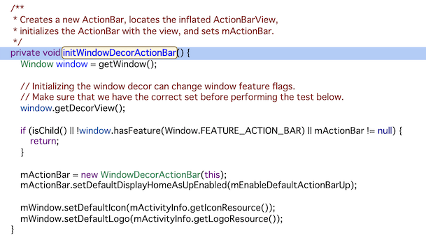
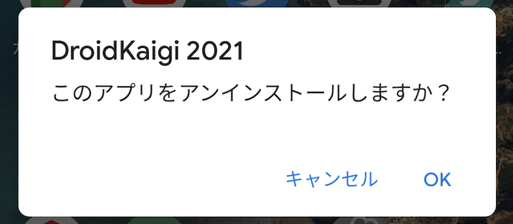
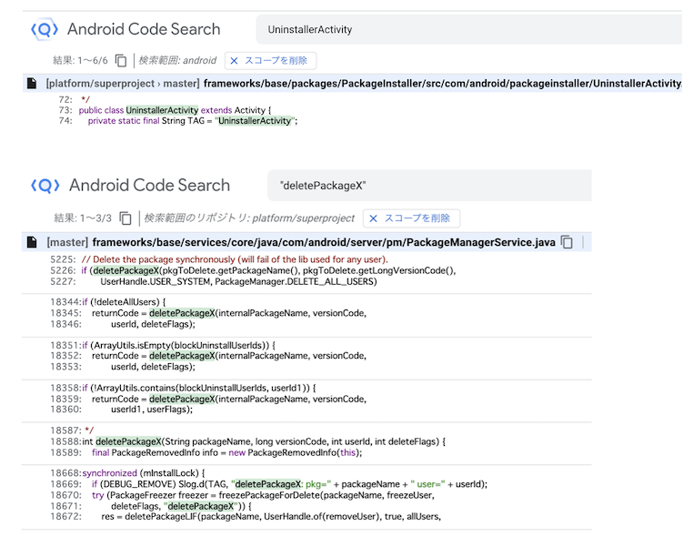
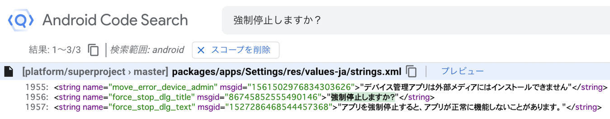
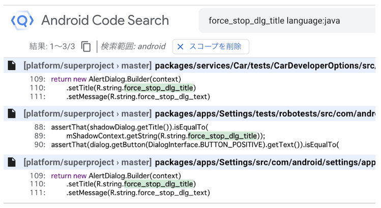
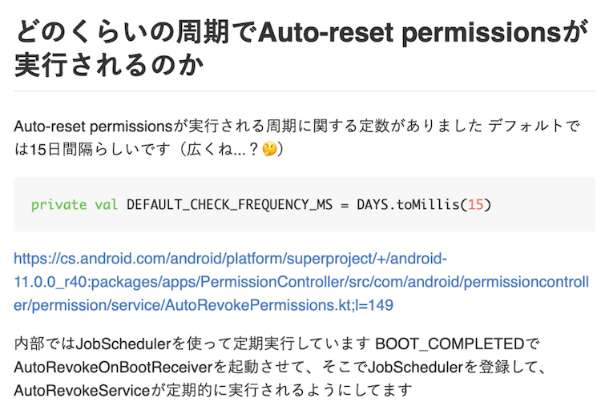
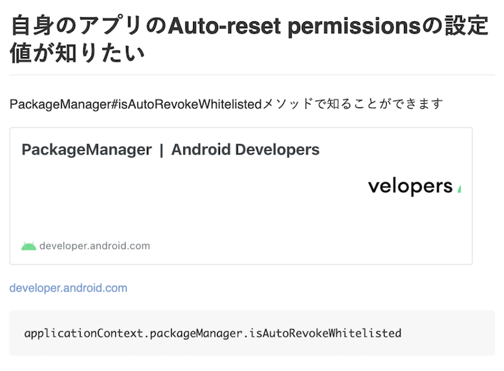

# できる！Android Framework Code Reading 

## 概要

```
Androidの面白さはオープンソースでコードが公開されているので、Androidがどのように動いているのか？などをコードを読めば知れるところです。
Androidの内部構造を知ることで、アプリ開発に役立つこともたくさんあります。

しかし、コードが公開されているとはいえ、膨大な量のソースコードでAndroidは作られています。
調べたい機能がどのように動いているのかを調べる際に、いきなり膨大な量のコードを読んでも挫折してしまうことがよくあります。

本セッションでは、そもそも「Android Frameworkってなに？」というところから、実際にFrameworkのコードをどのように読んでいくかなどをお話します。
具体的な内部構造の話よりも、「どのようにAndroid Frameworkのコードを読んで内部構造を調べるのか」をメインとして扱います。

具体的には以下のような項目についてお話する予定です。
・ Android Frameworkってなに？
・ なぜAndroid Frameworkのコードを読むのか
・ Android Framework Code Readingをする上で便利なサイト・ツールなどの紹介
・ 読みたい目的のコードを探し出す技術
・ Android Frameworkのコードを読む時に使える技術
・ Android Frameworkでアプリ開発者が手軽に読めそうな部分の紹介
・ コードを読んだ結果をうまくまとめる技術
```

## このセッションのゴール

- Android Frameworkのコードがなんとなく読めるようになる
- ツールを利用して読みたいコードを見つけられるようになる
- Android Frameworkのコードが読みたくなる！


## Android Frameworkってなに？

## Android software stack

- ざっくり言ってAndroid OSを構成しているもの
- いくつかのLayerで分かれている
- Android system architectureと表現されることもある
- とにかく広い・でかい・深い・やばい


## Android software stack


- https://source.android.com/index.html
- https://source.android.com/setup/intro


## Android software stack

- 全LayerのソースコードがほぼOSSとして公開されているので読める
- Kotlin/Javaでアプリ開発している人が気軽に読めるのは Android Framework Layer
- Android Framework LayerはおおかたJavaで書かれている
- それより下のLayerはC/C++、Rustなどで書かれている


## 本資料におけるAndroid Framework

- Android Framework = Android software stack という位置づけで書いています
- ただし本資料で紹介することは上位レイヤー向けのCode Readingをメインターゲットとしています


## Android Frameworkのコードを読む理由

- 読むことで内部の仕組みを理解し、アプリ開発等に役立てる
- なんとなく内部の仕組み知りたいなーという興味が湧いてしまうから
- 楽しいから☺️


## Android Framework Code Readingをする上で便利なサイト・ツールの紹介


## Android Code Search

- Code Search with Cross References for the Android Open Source Project
- https://android-developers.googleblog.com/2019/12/code-search-with-cross-references-for-aosp.html


## Android Code Search

- https://cs.android.com/


## Android Code Search(ACS)

- ブラウザ上でAndroid Frameworkのコードを検索・閲覧できるサイト
- コード量が膨大なAndroid Frameworkのコードを読む上で必須ツール
- Googleが運営をしている


## Android Code Searchのすごいところ

- 検索のフィルターが豊富
- 行数が多いコードでもサクサク表示される
- ブランチの切り替えができる
- 相互参照のリンクが貼られている
- メソッドの階層呼び出し、参照がわかる
- アウトラインめちゃ便利！


## 検索のフィルターが豊富

- 目的のコードを探すために役立つフィルターがいっぱい
- 検索窓でフィルターのSyntaxを補完してくれる
- Syntax reference
- https://developers.google.com/code-search/reference


## 行数が多いコードでもサクサク表示される

- 1万行くらいのコードなら読み込みも表示もサクサク
- 試しにIntent.javaを開いてみて！
- https://cs.android.com/android/platform/superproject/+/master:frameworks/base/core/java/android/content/Intent.java


## ブランチの切り替えができる

- 特定OSバージョンの動作を調べたい時に便利
- 古いOSバージョンのブランチもある
- コードを開いたままブランチ切り替えで、切り替え先のバージョンのコードに変わる
- そのうちAndroid 12のブランチも出るはず


## ブランチの切り替えができる


## 相互参照のリンクが貼られている

- メソッド・クラスなどへのジャンプができる
- コードにリンクが貼られているのでそれをクリックするだけ
- すべてのコードに相互参照のリンクがあるわけじゃないので注意


## 相互参照のリンクが貼られている


- https://cs.android.com/android/platform/superproject/+/android-11.0.0_r40:frameworks/base/core/java/android/app/Activity.java;l=5070


## 相互参照のリンクが貼られている



- https://cs.android.com/android/platform/superproject/+/android-11.0.0_r40:frameworks/base/core/java/android/app/Activity.java;drc=55d98d2ba142d6c35894b1092397e2b5a70bc2e8;l=3440


## メソッドの階層呼び出し、参照がわかる


- https://cs.android.com/android/platform/superproject/+/android-11.0.0_r40:frameworks/base/core/java/android/database/sqlite/SQLiteDatabase.java;l=830;bpv=1;bpt=1


## 定数も参照されている箇所がわかる


- https://cs.android.com/android/platform/superproject/+/android-11.0.0_r40:frameworks/base/core/java/android/database/sqlite/SQLiteGlobal.java;l=46;bpv=1;bpt=0


## アウトラインめちゃ便利！

- クラスに定義してある定数、メソッドなどが一覧で見れる


## アウトラインめちゃ便利！

- フィルターもできる！


## Android Code Search キーボードショートカット

- キーボード操作だけでもある程度使えるように考慮されてそう


## Android Code Searchの設定

- 色々変えられる
- 検索結果件数増やすのおすすめ
- 自分に合ったコードのフォントサイズに変更する


## Android Code Search 操作デモ

- 実際に操作してるところをデモします
- ぜひみなさんもお試しください！！
- https://cs.android.com/


## Code SearchはAndroidだけじゃない！

- Code Search for Google open source projects
- https://opensource.googleblog.com/2020/04/code-search-for-google-open-source.html


## こんなにいっぱい！！


- https://cs.opensource.google/


## Chromiumもある


- https://source.chromium.org/chromium


## AOSP Webサイト

- AOSP(Android Open Source Project)
- https://source.android.com/index.html
- Androidの色んなことがドキュメントでまとまってる
- 興味あるテーマを見つけて読んでみるのがおすすめ


## adb(Android Debug Bridge)

- 色々便利なadbコマンド
- 端末の状態を把握・操作する上で必須なツール
- 今回はCode Readingする際に、個人的に利用頻度が高いコマンドのみ紹介


## adb(Android Debug Bridge)

- adbの詳細や設定などは以下のリンクを見てください
- https://developer.android.com/studio/command-line/adb


## Logcat

- Androidシステムが書き出したログを出力するツール
- ログはCode Readingに役立つ素材の一つ


## Logcat

- Android Logging System
- https://elinux.org/Android_Logging_System


## よく使ってるLogcatコマンド例

- 基本これ。オプションは必要になったら使う。

```bash
adb logcat -v time
```


## よく使ってるLogcatコマンド例

- main以外のログが見たい場合には -b

```bash
adb logcat -v time -b system
```


## Logcatを表示しつつファイルに書き込む

- ログを後々また見たい場合に便利
- aliasにしておくといい

```bash
adb logcat -v time | tee logcat_main_$(date +"%Y%m%d-%H%M%S").log
```


## Logcatのオプションについて詳しく

- “Logcat command-line tool”
- https://developer.android.com/studio/command-line/logcat


## Logcatのおすすめ設定

- ログバッファのサイズを大きくする
- ログが流れて消えてしまうのを軽減できる
- 開発者向けオプションから変更できる


## Logcatの実装

- ここ
- https://cs.android.com/android/platform/superproject/+/master:system/logging/logcat/


## dumpsys

- システムサービスの状態を出力するツール
- システムサービス関連のCode Readingをする際には必須
- 開発時にも役立つ


## dumpsys

- システムサービスの状態を出力するツール
- システムサービス関連のCode Readingをする際に便利
- アプリ開発時にも役立つ
- https://developer.android.com/studio/command-line/dumpsys


## dumpsys

- 基本的に出力したいシステムサービスを指定する

```bash
adb shell dumpsys <service>
```


## dumpsys

- “pecoを使って特定のシステムサービスのdumpsysを簡単にする”
- https://qiita.com/operandoOS/items/15bc6d1053d3ab31b300


## bugreport

- と色んなログからCode Readingのヒントを得る場合に便利
- 取得できるログの数はめっちゃ多い

```bash
adb bugreport
```

## bugreport

- “Reading Bug Reports”
- https://source.android.google.cn/setup/contribute/read-bug-reports


## その他のadbコマンドについて

- DroidKaigi 2017でひたすらadbについて話したので興味ある方はぜひ！
- DroidKaigi 2017 コマンドなしでぼくはAndroid開発できない話
- https://speakerdeck.com/operando/komantonasitehokuhaandroidkai-fa-tekinaihua-1


## 読みたい目的のコードにたどり着く技術

- Android Frameworkはコード量が膨大なので適当に探しても読みたい目的のコードにたどり着けない😭
- さきほど紹介したサイトやツールを利用して読みたい目的のコードにたどり着く方法の例を紹介

## 読みたい目的のコードにたどり着く技術

- Android Code Searchの検索を使う
- Logcatなどシステムが出力するログを使う
- アプリ上に表示される文字列を使う


## Android Code Searchの検索を使う

- 読みたい目的のコードに関連しそうなワードで検索する
- なんとなく目的のコードの目星が付いてる場合はこれが一番早いかも
- 検索結果が多すぎる場合は、検索フィルターを活用して件数を絞っていく


## 検索フィルターを活用して件数を絞る

- さきほど紹介したLogcatのログバッファサイズを変える実装を探した例
- languageフィルターはおすすめ


## AndroidのRustってどこで使われてるの？

- “Rust in the Android platform”
- https://security.googleblog.com/2021/04/rust-in-android-platform.html


## AndroidのRustってどこで使われてるの？


## Logcatなどシステムが出力するログを使う

- 手頃なのはLogcatの出力を使うやり方
- システムが出力するログ = ログ出力のコードが存在する
- 出力しているコードにたどり着き、その周辺のコードから目的のコードへたどり着けるか探す


## こんな手順でログを使ってコードを探す

1. 読みたい目的のコードに関連する操作を行う
2. 操作1により出力されたLogcatから読みたいコードに関連するログを探す
3. 見つけたログから固定文字列を探す
4. 見つけた文字列をAndroid Code Search(ACS)で検索する


## こんな手順でログを使ってコードを探す

- 「アプリがアンインストールされる時に行われていること」を読みたい目的のコードとして、具体的に手順を説明
- 資料を見ながらみなさんの手元で実際にやってみることをおすすめします


## 1. 読みたい目的のコードに関連する操作を行う

- 操作時のログが見たいので、Logcatコマンドを実行しておく

```bash
adb logcat -v time
```


## 1. 読みたい目的のコードに関連する操作を行う

- 「アプリがアンインストールされる時に行われていること」を知りたいので、端末から適当にアプリをアンインストールする
- これが「読みたい目的のコードに関連する操作」です




## 2. 読みたいコードに関連するログを探す

- 操作1により出力されたLogcatから読みたいコードに関連するログを探す
- 地味に目grep力が問われる
- ログ出力の量が多い操作の場合はファイルに書き出した上で探す方がいい


## 2. 読みたいコードに関連するログを探す

- 関連しそうなログ発見


## 3. 見つけたログから固定文字列を探す

- 黄色部分は固定文字列っぽい雰囲気
- tag（UninstallerActivityの部分）は固定文字列でコード上に定義されていることが多いので検索に使いやすい

```
UninstallerActivity(19960):Uninstallingextras=Bundle[{com.android.packageinstaller.extra.APP_LABEL=DroidKaigi2021,com.android.packageinstaller.applicationInfo=ApplicationInfo{5f5ccecio.github.droidkaigi.feeder.debug},android.intent.extra.UNINSTALL_ALL_USERS=false, com.android.packageinstaller.extra.UNINSTALL_ID=-2147483643}]
I/ActivityManager( 1424): Force stopping io.github.droidkaigi.feeder.debug appid=10666 user=0: deletePackageX

I/ActivityManager( 1424): Killing 23256:io.github.droidkaigi.feeder.debug/u0a666 (adj 940): stop io.github.droidkaigi.feeder.debug due to deletePackageX
```

## 4. 見つけた文字列をACSで検索する

- 期待どおりいい感じに検索に引っかかりました
- 検索にヒットしたコードを起点に読みたい目的のコードを地道に探す




## システムが出力するログで使えそうなもの

- システムサービスのコードを読むならdumpsysのログを使うのがおすすめ
- 色んなログから探すならbugreportを使うのがおすすめ
- 読みたいコードによって使えるログは他にも色々ある


## アプリ上に表示される文字列を使う

1. 読みたい目的のコードに関連するアプリを探す
2. 操作1で見つけたアプリで読みたいコードに　関連する画面を探す
3. 見つけた画面から固定文字列を探す
4. 見つけた文字列をAndroid Code Search(ACS)で検索する


## アプリ上に表示される文字列を使う

- 「アプリが強制停止される時に行われること」を読みたい目的のコードとして、具体的な手順を説明
- 資料を見ながらみなさんの手元で実際にやってみることをおすすめします


## 1. 読みたい目的のコードに関連するアプリを探す

- 「アプリが強制停止される時に行われること」が知りたいので、設定アプリが良さそう


## 2. 読みたいコードに関連する画面を探す

- 「アプリが強制停止される時に行われること」が知りたいので、設定アプリのこの画面が良さそう


## 3. 見つけた画面から固定文字列を探す

- 「強制停止しますか？」は固定文字列っぽいので検索の素材にしましょう


## 4. 見つけた文字列をACSで検索する

- 検索して無事ヒットしました
- ACS日本語の検索も問題なく動くのよい！




## 4. 見つけた文字列をACSで検索する

- アプリ文言は検索すると高確率でstrings.xmlがヒットする
- ヒットしたstringのnameでさらに検索する
- nameで検索すると表示してる実装にたどり着く
- そこから周辺のコードを読んでいく


## 4. 見つけた文字列をACSで検索する

- いい感じに検索にヒットした
- language:javaをつけてstirngs.xmlが検索結果に引っかからないようにしてる
- 検索にヒットしたコードを起点に読みたい目的のコードを地道に探す




## Android Frameworkでアプリ開発者が手軽に読めそうなコードの紹介

## frameworks/

- Android Framework Layer全般のコード
- https://cs.android.com/android/platform/superproject/+/master:frameworks/


## frameworks/base/services/core/

- システムサービスのコード
- https://cs.android.com/android/platform/superproject/+/master:frameworks/base/services/core/


## frameworks/base/core/java/

- Android SDK全般のコード
- https://cs.android.com/android/platform/superproject/+/master:frameworks/base/core/java/


## packages/apps/

システムアプリ全般のコード
https://cs.android.com/android/platform/superproject/+/master:packages/apps/


## アプリ開発者が手軽に読めそうなコード

- Android Framework LayerはC/C++のコードも一部ありますが、Javaのコードもめっちゃあるので読み飽きることはないと思います！


## Code Readingの結果をまとめる

- まとめた結果はきっと誰かの役に立ちます☺️
- まとめておくと自分が見返す時に便利👍
- まとめてどこかに公開しておくのがおすすめです✨


## Code Readingの結果をどうまとめるか

- Code Readingした対象の概要を記載する
- Code Readingした理由とわかったことの要約を記載する
- 重要な実装部分はコード付きでメモる + コードのリンクをつける
- 参考になるドキュメントのリンクを貼る
- Code Reading最中メモを残し、それもざっと記載する


## Code Readingの結果をどうまとめるか

- それぞれの工程について、私が以前Code Readingして結果をまとめた記事を例に説明します
- まとめる際の参考になればと✨


## Code Readingの結果をどうまとめるか

- “Android11から導入されたAuto-reset permissionsを調べてみてわかったこと”
- https://hack-it-iron.hatenablog.com/entry/2020/12/14/081217


## Code Readingした対象の概要を記載する

- 対象が特定の機能であればその機能の概要を記載する
- 概要が書いてあるとCode Readingした結果のまとめも理解しやすくなる


## 理由とわかったことの要約を記載する

- 理由を書くと目的にあったコードを読むことに集中できる
- わかったことの要約を書くとまとめを読み返す際に便利


## コードとコードへのリンクを記載する

- Code Readingのまとめ文章だけで伝えるのは難しい
- 実装部分のコードも交えてまとめるのがおすすめ
- コードへのリンクも一緒にあるとなおよい👍




## 参考になるドキュメントのリンクを記載する

- Code Readingしている中で参考になりそうなドキュメントあれば、必要なところで記載する
- 参考リンク集みたいな形で最後の方にまとめて記載するのもあり




## メモを残し、それもざっと記載する

- Code Readingする上でメモは大事
- ちょっとしたメモでも消さずに残しておく
- まとめの最後の方にメモをそのまま雑に書いておくだけでも価値はある


- https://github.com/operando/JobScheduler-Code-Reading


## まとめ

- Android Frameworkのコードは読むテクニックを身につければ、わりとすんなり読めるようになります💪
- ただコード量が膨大なので根気強さは必要です😅
- 読んだらまとめを書いて知見を共有しましょう👍


## Thank you!


# これ以降は登壇時間の都合で削ったスライド集 （おまけ）


## Android Framework Code Readingのヒントになる書籍

- Androidを支える技術〈Ⅰ〉,〈Ⅱ〉
- Androidのなかみ InsideAndroid


## Android Frameworkのコードをダウンロードする

- Repoというツールを使うことでダウンロードできる
- Android OSを開発する上では必須なツール
- 色々大変なので本編での紹介を避けた😂
- https://source.android.google.cn/setup/build/downloading


## adb-peco

- 複数AndroidデバイスがPCに接続されている時にデバイス選択を支援してくれるツール
- https://github.com/tomorrowkey/adb-peco


## AIDEGen

- Android Frameworkの開発をIDEで行うために色々やってくれるツールっぽい
- https://android.googlesource.com/platform/tools/asuite/+/refs/heads/master/aidegen/README.md
- 使ったことないけど、資料を作ってる過程で見つけた


## AIDEGen

- “AIDEGenにIDEでAndroid Framework開発”
- https://codechacha.com/ja/android-aidegen/


## Session Buddy

- Chrome Extension
- https://sessionbuddy.com/
- 開いてるタブをタブ・ウィンドウの状態を保存できる
- Code Readingしてるとめっちゃタブ開きまくる
- 読んでる状態を一旦保存しておきたい場合に便利


## ツリー型タブ

- Firefox Add-ons
- https://addons.mozilla.org/ja/firefox/addon/tree-style-tab/
- 読んでいるコードのメソッド呼び出しの階層とかをツリー型のタブで管理するのに便利


## ちょっと昔話と感謝の気持ち

- ACSが公開される前は有志による運営で、OpenGrokというソフトウェアを使って似たものが構築されていた
- https://sites.google.com/site/devcollaboration/codesearch
- とてもお世話になりました🙏🏻すごく感謝しています！


## まったりAndroid Framework Code Reading

- Androidのソースコードを読んで、開発等に役立てる勉強会を数年前 私が主催者でやっていた
- 参加者のみなさんが読んだコードをまとめたのがGitHubにまとまってる
- 何かの参考になればと！
- https://github.com/AndroidFrameworkCodeReading/CodeReadingHistory