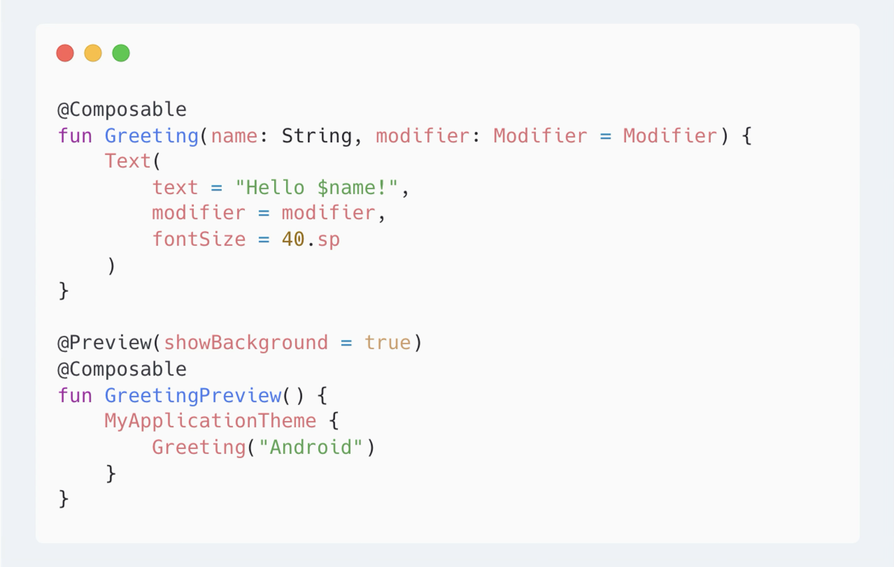
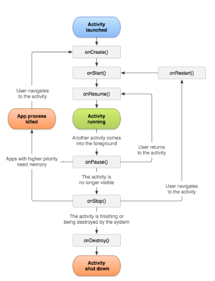

# 未経験者・初心者に贈る！40分でわかるAndroidアプリ開発の今と大事なポイント

これはDroidKaigi 2025で発表したスライドの文字起こしです。

### 自己紹介

- 岡野 忍（[@operandoOS](https://x.com/operandoOS)）
- LinQ / エンジニアリングマネージャー
- 位置情報共有アプリ whooの開発をしてます
- ポケモンGOでポケモンマスター目指してます

### このセッションについて

- 40分でAndroidアプリ開発の今と大事なポイントをなんとなく知ってもらう時間にできればと思います
- 紹介することがいっぱいあるので、広く浅くの説明になります
- コードはほとんど出てきません
- より詳細に知りたい場合は出てきたキーワードをAIに聞いてみるのがおすすめです。よりわかりやすく教えてくれます！
- FAQっぽいところではどっちつかずを避けるためあえて偏った回答をしてます

### このセッションの対象者

- Androidアプリ開発にこれからチャレンジしたい人
- Androidアプリ開発をはじめたばかりの人
- Androidアプリ開発を再チャレンジしたい人
- Androidアプリ開発を未経験者・初心者の方に教える人

## Androidの今

### Androidアプリが動く環境はさまざま

- スマートフォン、タブレット
- スマートウォッチ（Wear OS）
- ノートパソコン（Chrome OS）
- テレビ（Android TV）
- 自動車（Android Auto）
- XR （Android XR）

### OSバージョン

- 最新安定版 : Android 16
- Beta版 : Android 16 QPR2 Beta 2
- Android Canary

### OS バージョン分布

- 2025/04/01時点
- 最新であるAndroid 16はどこ？
- 日本だけにすると分布は変わると思う
- whooは全体の10%がAndroid 16でした

## 10分でわかるAndroidアプリ開発の今

### 標準的な開発環境

- IDE : Android Studio
- 開発言語 : Kotlin
- ビルドツール : Gradle
- 動作環境 : 実機 or エミュレーター

### Javaってどうなったの？

- 書く機会はほぼなくなった
- ただAndroid SDKはJavaで書かれてるなど読む機会はまだまだある
- 読んで理解できるようにしておくのがベストだが、Kotlinの学習優先でいい

### 実機とエミュレーターどっちがいいの？

- 私は実機派
- 昔に比べてエミュレーターの動作はかなり早くなった
- 手元にないOSバージョンの動作確認をする場合などにエミュレーターを使う
- エミュレーターと実機だとOSバージョンが同じでも挙動が異なることがある
- アプリを利用するユーザーは実機で動かすので、実機での動作確認は大事

### UIの実装方法

- Jetpack Compose
- View System（Android View）

### Jetpack Compose

- 宣言型UIフレームワーク
- Kotlinで記述
- View Systemの書き方が変わっただけではない
- View Systemに比べてコード量削減、開発効率化が見込める
- https://developer.android.com/compose
- https://developer.android.com/develop/ui/compose/documentation?hl=ja

### Jetpack Compose

### View System

- Androidの伝統的なUIフレームワーク
- 基本はXMLで記述する
- 実行時に動的にViewを操作したい場合にKotlinで記述
- https://developer.android.com/develop/ui/views/layout/declaring-layout?hl=ja

### View System

### どっちからはじめればいいの？

- どういった目的や環境でアプリを開発するかによって変わる
- 個人で新しいアプリを作るならJetpack Compose
- 仕事のために学ぶ場合は状況次第

### 仕事のために学ぶ場合

- 新規アプリ開発の場合はJetpack Compose
- 既存アプリ開発の場合はどっちを使ってるか次第
 - Composeのみ
 - View Systemのみ
 - ハイブリッド（Compose + View System）

### 企業で作ってるアプリのUI実装事情

- 主観 of 主観ですがこのくらいなイメージ
- Composeのみ：40%
- View Systemのみ：20%
- ハイブリッド：40%

### 企業で作ってるアプリのUI実装事情

- Xでアンケート取ってみた結果
- 投票してくださったみなさま、ありがとうございます🙏

### View Systemの今

- View Systemでアプリを作ることはまだまだできる
- Material Componentsのアップデートも行われている
- ただComposeに比べると全体的にアップデート頻度は少ない
- 細かいバグが修正されないこともある

### View Systemの全盛期を支えた技術

- Data Binding
- View Binding

### Data Binding学ぶべき？

- 学ばなくていいと思う

### View Binding学ぶべき？

- View Systemのみで画面を実装する場合があるなら学ぶべき
- 難しくないので大丈夫！

### ComposeとView Systemは共存できるの？

- できます！
- View Systemの一部でComposeを利用可能
- Composeの一部でView Systemを利用可能
- なのでView SystemからComposeへ部分的移行が可能
- 逆もまた然り（Composeでうまくいかなかったら戻すこともできる）

### Material Design

- Google’s open-source design system for building beautiful, usable products.
- https://m3.material.io/
- Material 1 → Material 2 → Material 3 → Material 3 Expressive
- 現在はM3が主流

#### Material 3 Expressive

- 表現力豊かなインターフェースで感情に訴えかけるUXを生み出す
- not M4
- Android 16 QPR1 Beta1からOSにも適用
- 個人的な感想ですが確かになんか良くなった

#### Material 3 Expressive

- 今日良さそうなセッションがあります！
- はじめてのMaterial3 Expressive by chuka
- 2025.09.11 / 15:20 ~ 16:00

### Material Design in Compose

- Material DesignをComposeで実装するためのライブラリ
- Composeを利用するならこれを使うのが基本
- https://developer.android.com/develop/ui/compose/designsystems

### Material Design Components (MDC) 

- Material DesignをView Systemで実装するためのライブラリ
- https://github.com/material-components/material-components-android

### Material Designどう学ぶべき？

- ドキュメントをざっと読むのおすすめ
- どんなコンポーネントがあるかを把握しておく
- サンプルでいいから実装して挙動も見ると理解が深まる
- M3以降の情報から学ぶでいい（M3から大きく変わってるので）

## UIやDesignの話はここまで

### Android Jetpack

- Jetpack is a suite of libraries to help developers follow best practices, reduce boilerplate code, and write code that works consistently across Android versions and devices so that developers can focus on the code they care about.
- 開発者がベストプラクティスに従い、定型コードを削減し、Androidのバージョンやデバイス間で一貫して動作するコードを記述して、重要なコードに集中できるようにするライブラリスイートです。

### Android Jetpack

- モダンなAndroidアプリを効率よく開発するためライブラリ
- OSバージョン間の差異を吸収してくれる👍
- androidxというパッケージ名で提供されている
- ComposeもJetpackの一部です
- 今メンテナンスされているアプリのほとんどがJetpackを利用しているはず

### Android Jetpack

- たくさんあるライブラリの中から利用頻度の高いものを列挙すると
 - Activity
 - AppCompat
 - Lifecycle / ViewModel
 - Navigation
 - Compose
 - WorkManager
 - Hilt
 - Room
 - Browser
 - CameraX

### Android Jetpack

- どんなライブラリがあるかは以下で確認できます
- https://developer.android.com/jetpack/androidx/explorer?hl=ja&case=all

### Android Jetpack

- GitHubにAOSPからのミラーがあり、コードが公開されてる
- https://github.com/androidx/androidx

### アーキテクチャ

- 複雑なアプリを長期的にメンテナンスする上でアーキテクチャは非常に重要
- アーキテクチャに関する共通の原則や推奨パターンがドキュメント化されている
- https://developer.android.com/topic/architecture?hl=ja
- https://developer.android.com/topic/architecture/recommendations?hl=ja

### アーキテクチャ x Jetpack

- 推奨アーキテクチャを実現するためJetpackを使う
- 例えば、ViewModel、Lifecycle、Compose、Navigation、Hiltなど
- ただあくまで推奨であり、どういったアプローチが最適か、何を使うかはそれぞれで判断すべき

### アーキテクチャ x Jetpack

- アーキテクチャガイドに沿ってJetpackを使ったサンプルアプリがいくつか用意されてるので参考にするといい
- https://github.com/android/nowinandroid
- https://github.com/android/compose-samples
- https://developer.android.com/jetpack/samples?hl=ja

### LiveDataってまだ使ってるの？

- 多くのケースでKotlin Flow + Lifecycleに置き換えられた
- なので使ってないなら学ぶ必要はない

### 非同期処理

- 時間がかかる処理をする場合にメインスレッドの動作を止めないため非同期処理は非常に重要
- ネットワーク通信、データベース操作など非同期で行うべき処理はたくさんある
- 現在はコルーチンを使って非同期処理を実装するのが主流

### Kotlin Coroutines（コルーチン）

- 非同期プログラミングをシンプルに実装するための仕組み
- async / awaitのような言語機能ではなく、ライブラリとして提供されている
- 軽量なスレッドのように動作し、非同期コードを直感的に書ける
- Jetpackライブラリの多くがコルーチンをサポートしている

### Kotlin Coroutines（コルーチン）

### Kotlin Coroutines（コルーチン）

- https://developer.android.com/kotlin/coroutines?hl=ja
- https://kotlinlang.org/docs/coroutines-overview.html
- https://kotlinlang.org/docs/coroutines-guide.html

### ネットワーク通信はどんなライブラリを使うの？

- 代表的なライブラリはRetrofit、OkHttp
- JsonパースはKotlinx Serializationをおすすめします
- https://github.com/square/retrofit
- https://kotlinlang.org/docs/serialization.html

### Kotlin Flow

- 非同期で複数の値を順次出力することができる = データストリーム
- UIの状態は連続的に変化するため、変更をリアルタイムで監視し、UIに反映させるのに適している
- Flow、StateFlow、SharedFlowの3種類がある
- JetpackでもFlowはよく使われている

## 10分でわかったかな？

## 無理無理

### 大丈夫です！いいコンテンツがあります！

- ここまでざっと話した内容を細かくコードも書きながら学べるコンテンツ
- 初心者の方はまずはこれをやるのが超おすすめ
- https://developer.android.com/courses/android-basics-compose/course?hl=ja

## 今も昔も変わらない大事な技術の紹介

### 4つのアプリコンポーネント

- Activity
 - ユーザーが操作する画面そのもの。4つのコンポーネントで唯一UIを持つ
- Service
 - バックグラウンドで動作するもの
- Broadcast Receiver
 - OSや他のアプリからのイベントを受信するもの
- Content Provider
 - アプリ間でデータを共有するための仕組み。連絡先や写真など、他のアプリが持つデータへのアクセスを管理をする

### 4つのアプリコンポーネント

- https://developer.android.com/guide/components/fundamentals?hl=ja

### よく利用するコンポーネントはどれ？

- Activityはアプリを作る上で絶対必要。ただ役割が変わりつつある
- Broadcast Receiverもまあまあ使う

### Activityの役割変化

- 昔は1画面 1Activityが基本だった（TopActivity, LoginActivityみたいな）
- 画面遷移の実装を簡潔にするNavigation Componentの登場が変化の転換点
- Navigation Componentにより1Activityで複数画面を実装・画面遷移することが簡単になった
- アプリ全体でActivity 1つになることも普通になりつつある

### Single Activityが全てではない

- Activityの数は明らかに減ったが、アプリの特性次第では複数Activityになることもある
- Single Activityにこだわり保守性が下がるなら複数Activityにしたほうがいい
- とはいえ現環境においては、複数Activityにも悩ましい点がある
- Activityの役割をしっかり理解するのが大事

### Broadcast Receiverの役割

- OSや他のアプリが発行するイベントを検知し、それに対して処理を実行する
- 例えば、『端末の起動が完了したことを検知し、なにか処理を実行する！』みたいなことができる
- 『端末でこれが起きたのをアプリで検知して、なにかしたい』と思った時にまずBroadcast Receiverが使えないかを考える
- どんなイベントが検知できるか知っておくのが大事

### Broadcast Receiverで検知できるイベント

- 以下リンク内にBroadcast Actionと記載があるものが、Broadcast Receiverで検知できるイベント
- https://developer.android.com/reference/android/content/Intent

### Broadcast Receiverの変化

- OSバージョンごとにBroadcast Receiverの動作が異なるため理解した上で利用するのが大事
- https://developer.android.com/develop/background-work/background-tasks/broadcasts?hl=ja#changes-system-broadcasts

### Serviceって最近どうなの？

- WorkManagerの登場により、Serviceを自前で実装する機会は減った
- ただ作るアプリの特性次第では大事な役割を担う
- それなりに難しいので自前で実装する場合はしっかり学ぶ必要がある
- 必要になったら学ぶでいい
- https://developer.android.com/develop/background-work/services?hl=ja

### Content Providerって最近どうなの？

- Storage Access Frameworkの登場により、Content Providerを直接利用する機会は減った
- OSで用意されているContent Providerを呼び出して利用することはたまにある
- 自前で実装する機会は少ない
- 私はContent Providerを実装したのはこれまで経験で1回だけ
- 必要になったら学ぶでいい
- https://developer.android.com/guide/topics/providers/content-providers?hl=ja

### ライフサイクル

- アプリコンポーネントにはそれぞれライフサイクルがある
- その中でもActivityのライフサイクルは必ず理解しておくべき
- ライフサイクルに合わせて処理を行いたい場面がたくさんある
- ライフサイクルを意識した実装がされてないと、バグやメモリリークなど様々な問題を引き起こす
- なので絶対絶対絶対理解しておくべき

### Activityのライフサイクル

- この図を何十回、何百回も見てきた
- https://developer.android.com/guide/components/activities/activity-lifecycle?hl=ja

### Intent

- アプリコンポーネント間の通信を行うためのメッセージングオブジェクト
- アプリ（Activity）の起動には必ずIntentが使われる
- 今だと他のアプリを呼び出すためにIntentを使うことが多い
- Intentには明示的Intentと暗黙的Intentの2種類ある

### IntentとIntent Filter

- これだけでかなり深い話になってしまうので、詳細は以下読んでもらえると🙏
- https://developer.android.com/guide/components/intents-filters?hl=ja

### Manifest

- アプリの構成情報を記述するXMLファイル（AndroidManifest.xml）
- アプリコンポーネント、権限、デバイス互換性などを宣言する
- ここの記述1つ間違えるだけで大きな問題につながることもあるので、しっかり理解しておくのが大事
- https://developer.android.com/guide/topics/manifest/manifest-intro?hl=ja

### Permission

- アプリが特定のアクションやデータアクセスするために必要な権限
- インストール時点で付与される権限と、実行時に許可を求める権限がある
- アプリが必要とする権限はマニフェストファイルに宣言する
- https://developer.android.com/guide/topics/permissions/overview?hl=ja

### Permission

- 実行時権限にはいくつかオプションがある
- 「アプリの使用時のみ」、「今回のみ」、「許可しない」
- 位置情報になると「常に許可」が増える

### Permission

### Permissionのちょっと難しい点

- 権限周りはOSバージョンによって挙動が異なる
- 今後のOSバージョンアップで挙動が変わる可能性もある
- 位置情報のようにセキュリティ、プライバシーに関わる権限を使う場合はしっかり理解しておくのが大事

### Resource

- 画像、文言、色、レイアウトなどアプリで使用する静的コンテンツを管理する仕組み
- コードとは別で管理することで、異なる画面サイズや解像度に対応したり、多言語対応などが容易になる
- リソースはresディレクトリ配下に格納し、コード上からはRクラスを通じてアクセスする
- https://developer.android.com/guide/topics/resources/providing-resources?hl=ja

### Context

- アプリ内外の様々な情報や機能にアクセスするためのインターフェース
- リソースへのアクセス、アプリコンポーネントの起動、通知の表示など使う場面は多い
- ActivityやApplicationクラスはContextを継承しています

### Context

- Contextを理解する by Okumura
- https://www.docswell.com/s/Okumura/ZMXX92-understanding-context
- https://youtu.be/1poogS3bGZA?feature=shared

### 今も昔も変わらない大事な技術

- ここで紹介したものは役割の変化はあれど、アプリ開発をする上でコアな部分なので、時間をかけてでも学ぶ価値は十分にある
- コアな部分だからこそ、OSバージョンが上がるタイミングで挙動が変わる可能性もあるため、できる限り最新情報をキャッチアップすることも大事

## あれ？Fragmentは？

### Fragment

- Fragmentとは？の説明をあえて省きます
- FragmentのUIとしての役割はComposeが担うようになりつつある
- View Systemで画面を実装する場合はFragmentを使うことが多い
- フルComposeアプリにおいてFragmentを利用する場面があれば教えてください！
- 使う場面がなければ学ばなくてもいい

## Androidアプリ開発を加速させる2つのサービス

### Androidアプリ開発を加速させる2つのサービス

- Google Play services
- Firebase

### Google Play services

- Googleの認定を受けたデバイスにインストールされているアプリ
-『Google Play開発者サービス』という名前のアプリがそれ
- 利用者が明示的にアップデートしなくても、自動でアップデートが行われる
- これがあることでできることは様々ですが、わかりやすいのだとGoogleが提供するサービスを簡単に自身のアプリに組み込めるとか

### Google Play services SDK

- Google Play開発者サービスで実行されるサービスとやり取りするためのライブラリ
- 例えば、Maps、Pay、認証、位置情報、など
- まずはどんなことができるのかを把握し、必要に応じて利用を検討する
- https://developers.google.com/android/guides/setup?hl=ja&device=phone-tablet#list-dependencies

### Google Play services

- 公式ドキュメントのこの図がわかりやすい
- IPC = プロセス間通信
- https://developers.google.com/android/guides/overview?hl=ja

### Firebase

- Googleが提供するモバイルおよびウェブアプリ開発プラットフォーム
- 認証、データベース、クラウドストレージ、ホスティング、アナリティクス、プッシュ通知など、多くのバックエンドサービスを提供
- 利用することで、バックエンドの構築や管理の手間を大幅に削減でき、本格的なサービスが作れる
- https://firebase.google.com/?hl=ja

### Firebase

### Firebase

- アプリ単体で利用するサービスは以下参照するのがおすすめ
- https://firebase.google.com/docs/run?hl=ja

### Firebase

- たくさんサービスがありますが、よく使うものを列挙すると
 - Crashlytics（クラッシュレポート）
 - Analytics（アナリティクス）
 - Cloud Messaging（プッシュ通知）
 - Remote Config（リモート設定）
 - App Distribution（アプリ配布）
- 列挙したサービスはすべて無料で利用可能

### Firebase SDK

- Firebase SDKほとんどコードが公開されている（AnalyticsとAuthだけ公開されてない）
- https://github.com/firebase/firebase-android-sdk

### Google Play services と Firebase

- Firebaseの一部サービスはGoogle Play servicesと依存関係にあります
- https://firebase.google.com/docs/android/android-play-services?hl=ja

## ここから先は知っておくとよりよいトピックを駆け足で紹介   

### マルチモジュール

- コードベースが大きくなると、ビルド時間が長くなったり、コードの管理が難しくなる
- 適切なモジュール分割、モジュール間の依存関係を工夫していい感じにする
- コードベースが小さいうちからモジュール分割を意識してやるのもあり
- Androidアプリ開発においてマルチモジュールは一般的になった
- https://developer.android.com/topic/modularization?hl=ja

### R8

- コードの最適化・難読化、リソースの縮小を行うツール
- これを行うことでアプリの動作が早くなるなどの効果が見込める
- 難読化はProGuard設定ファイルの定義に沿って行われる
- https://developer.android.com/topic/performance/app-optimization/enable-app-optimization?hl=ja

### R8

- 実践！難読化ガイド by みっちゃん
- https://speakerdeck.com/mitchan/shi-jian-nan-du-hua-gaido
- https://youtu.be/6tDTjrvYPY8?feature=shared
- R8/ProGuard 徹底比較 by Sato Shun
- https://speakerdeck.com/satoshun/proguard-che-di-bi-jiao
- https://youtu.be/g89JWJjE22A?feature=shared

### セキュリティ

- 昔に比べるとOSそのものが堅牢になったが、アプリ開発側でのセキュリティ対策は必須
- 『Android アプリのセキュア設計・セキュアコーディングガイド』を読むのがおすすめ
- https://www.jssec.org/dl/android_securecoding/
- https://www.jssec.org/dl/android_securecoding.pdf

### セキュリティ

- 公式ドキュメントも充実してるのでおすすめ
- Understand common security risksセクションは学びが多い
- https://developer.android.com/privacy-and-security/security-tips
- 言語設定 日本語にすると古いドキュメントが出るので英語にして読む

### apk（Android package）とaab（Android App Bundle）

- apkはアプリの実行に必要なファイルを含んだ圧縮ファイル（拡張子 .apk）
- aabはアプリのすべてのコードやリソースを含むファイル（拡張子 .aab）
- Google Playからアプリを配信する場合、必ずaab形式でアップロードする必要がある
- Google Playはaabを元に、ユーザーのデバイスに最適化されたapkを生成して配信する
- https://developer.android.com/guide/app-bundle

### 新しいOSバージョン対応

- 多くのAndroidエンジニアが経験するOSバージョンアップ対応
- 大変な作業ですが、これをやることで最新OSの機能や変更点を学ぶいい機会になる
- 対応しないとGoogle Playで新しいアプリの配信、既存アプリのアップデート配信が行えなくなる
- 新しいOSバージョンが出てから1年以内に対応することが通例になっている
- https://developer.android.com/google/play/requirements/target-sdk?hl=ja

### 新しいOSバージョン対応の攻略法

- 公式ドキュメントをひたすら読む
- Beta版などを利用して新しいOSバージョン上でアプリがどう動くのかを早めに確認する
- 以下それぞれの違いを把握する
 - targetSdkVersionに関係なく（アプリ側でなんにもしなくても）新しいOS上で稼働する場合に適用される変更
 - targetSdkVersionを新しいOSにする（アプリ側で新しいOSに対応することを明示的に宣言）ことで適用される変更

### adb（Android Debug Bridge）

- Androidデバイスと通信するためのコマンドラインツール
- アプリのインストール、ログの取得、シェルコマンドの実行、端末操作など、とにかく色んなことができる
- 端末の状態を詳しく確認しながらアプリのデバッグをする際にはめっちゃ役立つ
- https://developer.android.com/tools/adb?hl=ja

### adb（Android Debug Bridge）

-  コマンドなしでぼくはAndroid開発できない話 - DroidKaigi 2017
- https://speakerdeck.com/operando/komantonasitehokuhaandroidkai-fa-tekinaihua-1
- Android Command Note（全く更新できてないので頑張ります...）
- https://github.com/operando/Android-Command-Note

## 最新の情報とトレンド

### 最新情報はどうやって集めてるの？

- 私はRSSリーダーとXを主に活用している
- 全部読むと数が多くて大変なので、興味あるものだけ読む（NotebookLM使ってる）
- 最近だと月1でNow in Androidが公開されるので、これ見るでもいい
- https://developer.android.com/series/now-in-android
- あとはAndroid Developers JapanブログのBi-Weekly Updateもおすすめ
- https://android-developers-jp.googleblog.com/

### 最新情報はどうやって集めてるの？

- Android Developers Blog
- https://android-developers.googleblog.com/
- AndroidDagashi
- https://androiddagashi.github.io/

### 最新情報はどうやって集めてるの？

- 日頃チェックしてるサイトのURL以下にまとめました！
- https://github.com/operando/DroidKaigi/blob/master/2025/urls.md

### トレンドってどうつかむの？

- Xで話題になってたり、勉強会やDroidKaigiで発表されてるトピックをチェックする
- QiitaやZennに投稿される記事をチェックする
- 接触頻度が高いトピックだけ追うようにしてる

### 最新情報やトレンドはどこまでキャッチアップすればいいの？

- 正直人それぞれ
- 仕事でやってると常に最新技術やトレンドを試せるわけではない
- 気軽に試せる + 作ってるアプリに大きく役立つものから優先にキャッチアップしてる
- 私は世の中の一般的な流れから1〜2年遅れでキャッチアップしてる
- キャッチアップが遅れたからってアプリ開発ができなくなることはない！大丈夫！

## アプリ開発がどうやったらもっと上達するか

### サンドボックス環境で色々試す

- 仕事でアプリを作ってる場合、仕事とは別に気軽に試せる環境を用意しておく
- 毎回新規プロジェクトを作って、気になることを試すでもいい
- GitHub等で公開されているアプリのコードを利用する（例えばDroidKaigiのアプリとかね！）

### もっといい実装方法がないか？を問う

- 最初に学んだ実装方法をずっと使い続けてしまうけど、探すともっといい方法が見つかることもある
- できることが同じでも、よりよい実装方法を模索する
- 今の実装方法がベストなのか気になった時、比較・参照できるものを用意しておく

### 自身の実装と他の実装を比較・参照できるものの用意

- GitHub等で公開されているコードを利用する
- 比較・参照できる対象を多く持っておく
- https://github.com/kickstarter/android-oss
- https://github.com/android/nowinandroid
- https://github.com/android/compose-samples
- https://github.com/wikimedia/apps-android-wikipedia
- https://github.com/DroidKaigi/conference-app-2025
- https://github.com/protonpass/android-pass
- https://github.com/protonpass/android-authenticator

### 自身の実装と他の実装を比較・参照できるものの用意

- AOSPのコードを読む
- https://cs.android.com/

### 色んなアプリを触ってみる

- ストア ランキングにのってるアプリを触る
- イケてるAndroidエンジニアが作ってるアプリを触る
- Googleが作ってるアプリを触る
- 触ることでUI、表現、挙動など参考になりそうな情報を吸収する
- iOSも触るとより知識の幅が広がる

### 公式ドキュメントを読む

- 困ったことがあればまず公式ドキュメントを読む習慣をつける
- 公式ドキュメントは常にアップデートされるのがいい
- 10年やってて「そんなの知ってるよ！」って内容のドキュメント読んでも新しい発見がある
- Androidは公式ドキュメントの量が多いので、developer.android.comでキーワード検索するのがよい

### 公式ドキュメントでキーワード検索するChrome拡張作った

- この資料書いてて検索するためにdeveloper.android.comにアクセスするの面倒なのに気づいた
- 楽に検索できるChrome拡張を作ってみたのでご自由にお使いください
- https://github.com/operando/Android-Developer-Search-Chrome-Extension

### 公式ドキュメントは楽しい！

### 試したこと・学んだことをアウトプットする

- ブログ、SNS、勉強会などでアウトプットする
- アウトプットすることで理解が深まる、理解できないところが明確になる
- アウトプットドリブンで学習が進む
- 登壇を目的にしていい！DroidKaigiで登壇するために学ぶぞ！

### アウトプットのコツ

- ユニークな内容である必要はなく、自分のためにアウトプットすればいい
- 自分のためのものであれば内容は雑でいい
- はじめは「こんなのアウトプットしても意味ないか」 = 誰かの役に立つかどうかは考えない
- やる気になった時にやればいい

### Android内部の実装を読み動きを理解する

- AOSP（Android Open Source Project）
- Androidの内部実装を知れたり、コードを読むことができる
- https://source.android.com/
- Android Code Search
- https://cs.android.com/

### Android内部の実装を読み動きを理解する

- できる！Android Framework Code Reading - DroidKaigi 2021
- https://youtu.be/44ChiZXry1E?feature=shared
- https://speakerdeck.com/operando/dekiru-android-framework-code-reading

### Android内部の実装を本で学ぶなら

- Androidを支える技術
- https://gihyo.jp/book/2017/978-4-7741-8759-4
- https://gihyo.jp/book/2017/978-4-7741-8861-4
- Androidのなかみ
- https://www.personal-media.co.jp/book/comp/288.html

### Jetpack Composeの内部を本で学ぶなら

- Jetpack Compose internals
- https://leanpub.com/composeinternalsjpn

## アプリ開発がどうやったらもっと楽しくなるか

### 好きな領域・得意な領域を見つけよう！

- 例えばComposeめっちゃ詳しいです！とか、通知にめっちゃ詳しいです！とかなんでもいい
- 私は内部実装を紐解いたり、adb色々試すのが好き。あとlogcat眺めるの大好き！！
- 定期的に変化がある領域だと飽きずに楽しめる

### 実機を買おう！

- 実機で自分が作ったアプリが動くのは楽しい
- 安いやつでも全然OK
- Pixelはいいぞ！（安くないけど…）
- Pixelは最新OSバージョンのBetaなど試せるのが大きなメリット
- ちなみに私はPixel 8を使ってます

### コミュニティに参加して仲間を見つけよう！

- これまで私はコミュニティを通じていっぱい仲間ができました
- 好きな技術を話せる仲間がいると楽しい！
- DroidKaigiは仲間を見つけるのに絶好の機会です！
- ぜひDroidKaigiで仲間を見つけてください！
- 私にも話しかけてください！お願いします🙏

### おわりに

- これからAndroidアプリ開発にチャンジする方、初心者の方はコミュニティにいるエンジニアの力を借りて楽しく学んでいきましょう！
- アプリ開発をする上で今回紹介したこと以外もまだまだいっぱい学ばなければいけないことが出てきます
- 一つ一つを焦らず丁寧に学んでいけばアプリ開発のスキルは必ず上がります
- みなさんが楽しくAndroidアプリ開発をできることを祈ってます🙏
